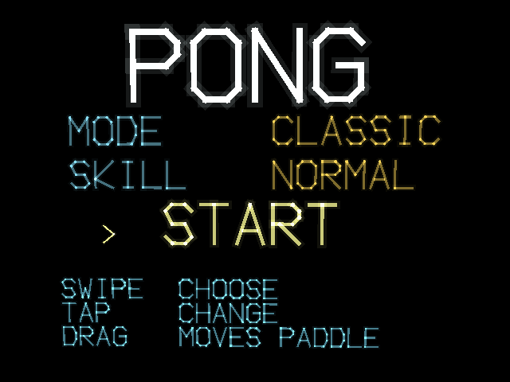
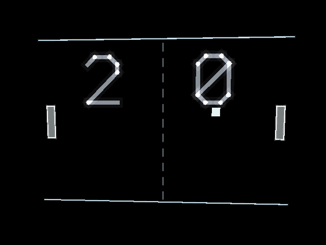

# x3pong

x3pong is Pong for the RayNeo X3 Pro AR glasses, built as two distinct games selectable from the opening screen rather than one game with a skin swap. Classic reproduces 1972 exactly — constant ball speed, angle controlled only by where the ball meets the paddle, flat single-color rendering, first to 11 — while Remix keeps that same skeleton and adds acceleration that builds through a rally and paddle-imparted spin, rendered in neon with particles and a synthwave soundtrack, playing to 7. The AI opponent's difficulty is tuned across three separate variables — how much court it has to cover, how quickly it reacts, and how far off its aim is — rather than a single speed slider, so a weaker opponent loses in a way that still feels like a rally. The paddle follows your finger's absolute position along the temple pad directly, rather than moving in fixed steps, so you can place it exactly where the ball is headed.

## Screenshots

  
  

## Controls

- Drag on the temple pad to move your paddle (your finger's position is the paddle's position)
- Swipe to move between menu rows
- Tap to change a value or start
- Double-tap to abandon the match and return to the menu

## Download

[X3Pong.apk](X3Pong.apk)
